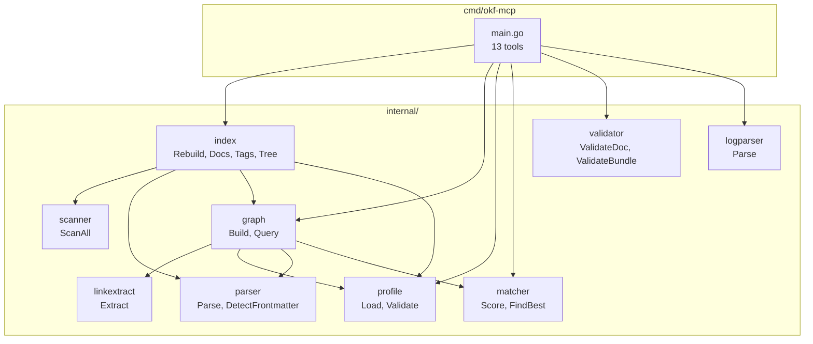
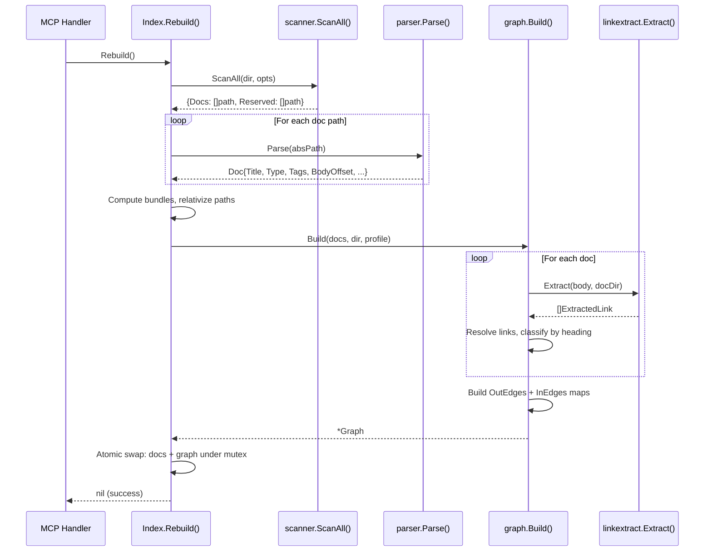

**Status:** updated

## Problem

Agents working with OKF-conformant documentation corpora must manually reconstruct the relationship graph between documents by reading each file, parsing its links, and mentally tracking which document references which under what context. For a corpus of 50–500 documents this is slow, error-prone, and does not survive across sessions. There is no way to ask "what depends on this design?" or "does every requirement have a downstream implementation?" without reading the entire corpus.

The existing okf-mcp server indexes documents by frontmatter metadata (type, title, tags, description) and serves content retrieval and conformance checks. It has no awareness of the relationships between documents — the Markdown links that encode dependency, derivation, implementation, and supersession semantics.

This design adds a rebuildable graph projection: a directed graph derived entirely from OKF source documents, queryable through MCP tools, with profile-based relationship vocabulary and integrity/coverage analysis — without modifying OKF documents or introducing a second canonical knowledge store.

## Constraints

| Constraint | Source | Impact |
|---|---|---|
| Single binary, no CGO, no database, no HTTP | Existing okf-mcp architecture | Graph must be in-memory, no external dependencies beyond existing `mcp-go`, `yaml.v3`, and `goldmark` (Markdown AST parser) |
| Rebuild-on-every-call pattern | Existing `Index.Rebuild()` design (I-2, no file watcher) | Graph must be buildable in milliseconds for 50–500 file corpora |
| Preserve all 19 existing invariants (I-1 through I-19) | AGENTS.md §3 | Graph tools use relative paths, live-read from disk, handle zero-doc startup, etc. |
| Domain-neutral core | Acceptance criteria ("not Agentic OS-specific") | Relationship vocabulary defined by profiles, never hard-coded |
| No graph mutation API | "Not this" (not auto-modifying OKF documents in v1) | Graph is read-only projection; all changes flow through OKF source edits |
| No proprietary graph serialization in OKF frontmatter | "Not this" | Relationship typing derived from Markdown heading context, not embedded in YAML |
| OKF documents remain canonical source of truth | Core acceptance criterion | Graph is derived, never authoritative; rebuilding from same corpus yields same graph |

## Invariants & guarantees

The following invariants extend the existing I-1 through I-19. Each new invariant is numbered from I-20.

### I-20 — Derivation purity

**Guarantee:** Every node and edge in the graph is derived from an OKF source document. No graph mutation API exists.

**Precondition:** OKF documents exist in the scan root.

**Component:** `internal/graph` (Build function).

**Falsification test:** Create a document with a link, rebuild → node and edge appear. Delete the document, rebuild → node and edge disappear. No API to add a node or edge without a corresponding document.

### I-21 — Rebuild determinism

**Guarantee:** Two consecutive Rebuilds on an identical corpus produce identical graph output (same nodes, same edges, same ordering).

**Precondition:** No concurrent filesystem mutations during Rebuild.

**Component:** `internal/graph` (Build function), `internal/linkextract` (Extract function).

**Falsification test:** Build graph from fixture corpus twice → deep-equal result. Shuffle document processing order → same result.

### I-22 — No phantom nodes

**Guarantee:** Every node in the graph corresponds to an indexed document (one that passed the parser gate: has frontmatter with non-empty `type`).

**Precondition:** `Index.Rebuild()` has completed successfully.

**Component:** `internal/graph` (Build function).

**Falsification test:** Create a Markdown file with no frontmatter, link to it from another doc → the link target appears as a dangling reference, not as a graph node.

### I-23 — Edge endpoint integrity

**Guarantee:** Every edge endpoint references a valid indexed document or is recorded as a dangling reference with source file, raw target, and heading context.

**Precondition:** Graph has been built from a corpus.

**Component:** `internal/graph` (Build function), `DanglingRef` type.

**Falsification test:** Link to a non-existent file → appears in `Dangling` slice, not in `OutEdges`.

### I-24 — Inverse edge derivation

**Guarantee:** For every edge A→B with type T, querying B's incoming relationships returns A with type `inverse(T)`. Inverse edges are derived, not stored as separate facts.

**Precondition:** Profile defines an inverse name for T (or generic fallback `referenced_by` is used).

**Component:** `internal/graph` (Build function constructs `InEdges` map).

**Falsification test:** Create doc A with a "Depends on" link to doc B. Query B's incoming → includes A with type `depended_on_by`.

### I-25 — Untyped link preservation

**Guarantee:** Links under unrecognized headings (no profile heading match) are recorded as `untyped` relationships, not discarded.

**Precondition:** Profile is loaded (or not — even with no profile, all links are preserved as untyped).

**Component:** `internal/linkextract` (Extract function), `internal/graph` (Build function).

**Falsification test:** Create a doc with a link under heading "Notes" (not in any profile). Rebuild → edge exists with type `untyped`.

### I-26 — Profile-optional operation

**Guarantee:** With no profile loaded, all relationships are `untyped`. Graph tools still function: navigation, search, trace, context all work with untyped edges. Integrity queries that depend on profile rules return empty results with a note that no profile is loaded.

**Precondition:** `--profile` flag not set and no `.okf-profile.yaml` found.

**Component:** `internal/profile` (Load function), `internal/graph` (Build function).

**Falsification test:** Run without profile → all edges are untyped, `graph_integrity` returns no profile-violation findings.

### I-27 — Path consistency (I-1 extended)

**Guarantee:** All file paths in graph tool responses are relative to the scan root, consistent with I-1.

**Precondition:** `Index.Rebuild()` has relativized all paths.

**Component:** `internal/graph` (Node and Edge types carry relative paths).

**Falsification test:** Build graph, call `graph_concept` → `file_path` is relative, never absolute.

### I-28 — Zero-state safety (I-7 extended)

**Guarantee:** Graph tools handle zero-document and zero-edge corpora without panic. Empty graph returns empty results, not errors.

**Precondition:** Server started in an empty directory.

**Component:** All graph tool handlers.

**Falsification test:** Start server in empty dir, call every graph tool → returns empty arrays, not panics.

### I-29 — Dangling reference completeness

**Guarantee:** Every unresolvable link is recorded with: source file path, raw link target string, and the heading context under which it was found.

**Precondition:** Graph has been built from a corpus containing at least one unresolvable link.

**Component:** `internal/graph` (Build function), `DanglingRef` type.

**Falsification test:** Create doc A with `[link](/nonexistent.md)` under heading "Dependencies". Rebuild → `Dangling` contains entry with Source=A, Target="/nonexistent.md", Heading="Dependencies".

### I-30 — Corpus-root containment

**Guarantee:** Every resolved Markdown path in the graph MUST remain inside the configured OKF scan root. Path traversal inputs such as `../../../../etc/passwd` MUST NOT escape the corpus root during link resolution, graph inspection, or any query operation. A link whose resolved path falls outside the scan root is silently dropped — not returned by the extractor, not recorded as a graph node, edge, or dangling reference.

**Precondition:** `Index.Rebuild()` has been given a scan root directory.

**Component:** `internal/linkextract` (link resolution), `internal/graph` (Build function).

**Falsification test:** Create doc A in `docs/sub/deep.md` with `[escape](../../../../../../etc/passwd)`. Rebuild → the link does NOT appear in `Dangling`, `OutEdges`, or `Nodes` (silently dropped), and no path in any graph response contains `..` or resolves above the scan root.

### I-31 — Profile heading-alias uniqueness

**Guarantee:** No two relationship definitions in a loaded profile MAY share the same normalized heading alias. If two relationships claim the same alias, `profile.Load()` rejects the profile with a descriptive error naming the conflicting alias and the two relationship definitions involved.

**Precondition:** A profile YAML file is being loaded (via `--profile` flag or auto-discovery).

**Component:** `internal/profile` (Load function, validation step).

**Falsification test:** Create a profile with two relationships that both list `"Depends on"` as a heading alias → `profile.Load()` returns an error containing the conflicting alias name. Server logs warning and falls back to `profile.Default()` (auto-discover path) or exits with code 2 (explicit `--profile` path).

## Options considered

### Option A: Graph embedded in index.Rebuild()

Graph building logic lives directly in the `index` package, called at the end of `Rebuild()` before the mutex swap.

**How it works:** After parsing docs and computing bundles, `Rebuild()` iterates each doc, reads its body from disk, extracts links, classifies them, and populates adjacency lists — all within the `index` package.

**Pros:**
- Single rebuild cycle, graph always consistent with index.
- No new package to wire.

**Cons:**
- Index package grows from 314 lines to 600+ lines — violates single-responsibility.
- Link extraction, profile matching, and adjacency-list construction are distinct concerns that belong in separate packages.
- Test surface balloons — index tests now need graph-assertion fixtures.

**Risks:** Package bloat leads to coupling between graph internals and index internals; future graph features (coverage algorithms, trace logic) pull more logic into the wrong package.

### Option B: Separate graph package orchestrated by index (Recommended)

New `internal/graph` package owns graph data structures and the `Build()` function. New `internal/linkextract` package owns Markdown link extraction. New `internal/profile` package owns profile schema and loading. `Index.Rebuild()` calls `graph.Build()` after building the doc slice.

**How it works:** `Rebuild()` flow becomes: scan → parse → compute bundles → `graph.Build(docs, dir, profile)` → atomic swap (docs + graph together) under mutex.

**Pros:**
- Clean separation: graph, link extraction, and profile are independently testable.
- Index orchestrates but doesn't own graph internals.
- Each package has a focused test surface.

**Cons:**
- Three new packages to create and wire.
- `Rebuild()` now reads file bodies (for link extraction) — a cost increase over the current frontmatter-only read path.

**Risks:** Body re-reading is acceptable — `parser.Parse()` already calls `os.ReadFile()`, so the file is in OS page cache. Graph builder re-reads the same files for body content, consistent with I-2 (live read).

### Option C: Lazy graph construction with invalidation

Graph is built lazily on first graph-tool call after each Rebuild, cached until next Rebuild.

**How it works:** Rebuild sets a `graphStale` flag. First graph-tool call checks the flag, builds the graph if stale, caches it. Non-graph tool calls never pay graph-build cost.

**Pros:**
- Non-graph tools (list_tags, list_docs, get_doc) don't pay graph-build cost.
- Cleaner separation of concerns.

**Cons:**
- First graph query has unpredictable latency (building graph for 500 docs).
- Cache invalidation logic adds complexity (stale flag, double-check locking).
- Inconsistent with the existing rebuild-on-call simplicity — two different freshness models in one server.
- Testing complexity: need to verify stale-flag behavior across concurrent calls.

**Risks:** The "fast path" optimization is premature for 50–500 file corpora where graph build takes <100ms. The complexity cost is not justified.

## Recommendation

**Option B** — separate graph package orchestrated by index.

Key reasons:

1. **Separation of concerns.** Graph data structures, link extraction, and profile loading are distinct packages that can be developed, tested, and evolved independently. This matches the existing package decomposition pattern (scanner/parser/index/matcher/validator are all separate).

2. **Atomic consistency.** Graph is built inside `Rebuild()` and swapped atomically with the doc slice under the same mutex. No stale-flag complexity, no cache-invalidation races.

3. **Acceptable cost.** For 50–500 file corpora, reading bodies and extracting links adds <100ms to the rebuild cycle. The existing `parser.Parse()` already reads every file; the graph builder re-reads the same files (OS page cache hit) to get body content, consistent with I-2.

4. **Test isolation.** Each new package (`graph`, `linkextract`, `profile`) has its own `_test.go` with focused fixtures. Integration tests in `cmd/okf-mcp/` drive assertions through the real MCP pipe, consistent with the existing test pattern.

## Architecture diagram



### Rebuild data flow



## Package structure and responsibilities

### `internal/linkextract`

Extracts Markdown links from document body content using AST parsing. This is a pure function package — no I/O, no profile dependency.

**Dependency:** Uses [`goldmark`](https://github.com/yuin/goldmark) — a CommonMark-compliant Markdown parser for Go — to parse the document body into an AST and walk it for link nodes. This is a correctness requirement: regex-based extraction cannot reliably distinguish links in prose from links in code fences, escaped Markdown, nested syntax, or reference-style link definitions.

**Responsibilities:**
- Parse Markdown body text into an AST using `goldmark`
- Walk the AST to find `Link` nodes (inline `[text](target)` and reference-style `[text][ref]`)
- Determine the nearest ancestor `Heading` node for each link (H1–H6)
- **Skip links inside `FencedCodeBlock`, `CodeBlock`, `CodeSpan`, and `HTMLBlock` nodes** — these are documentation about links, not actual cross-references
- **Skip escaped links** (e.g., `\[not a link\](target)`) — goldmark's AST correctly represents these as text, not Link nodes
- Resolve relative link targets against the document's directory
- Verify resolved paths remain inside the corpus root (I-30)
- Skip non-file links (http://, mailto:, anchor-only `#section`)
- Return structured `ExtractedLink` values

**Key types:**

```go
type ExtractedLink struct {
    Target        string // resolved relative path (cleaned, no leading /)
    RawTarget     string // original link target from Markdown source
    Heading       string // nearest ancestor heading text ("" if none)
    HeadingNormal string // normalized heading for profile matching
    Line          int    // 1-based line number in body
}

func Extract(body string, docDir string, corpusRoot string) []ExtractedLink
```

The `corpusRoot` parameter enables the containment check (I-30): after resolving a link target to an absolute path, `Extract` verifies it is under `corpusRoot` using `filepath.Rel` + prefix check. Links that escape the corpus root are **not returned** — they are silently skipped (the graph builder treats them as non-existent, not as dangling references, since recording an attacker-controlled path in diagnostic output could itself be an information leak).

**AST walk rules:**

The extractor walks the goldmark AST with a `ast.Walk` visitor that:

1. **Tracks the current heading:** When entering a `Heading` node, records its text content and depth. When leaving, restores the parent heading (stack-based).
2. **Skips opaque subtrees:** When entering `FencedCodeBlock`, `CodeBlock`, or `HTMLBlock`, returns `ast.WalkSkipChildren` — no links inside these nodes are extracted.
3. **Extracts Link nodes:** When entering a `Link` node (not inside a skipped subtree), records the destination URL, the nearest heading, and the source line number.
4. **Handles reference-style links:** goldmark resolves `[text][ref]` references against `[ref]: url` definitions during parsing, so the AST `Link` node already carries the resolved destination. No separate reference-table walk is needed.

**Link resolution rules:**

| Link format | Resolution | Example |
|---|---|---|
| `[t](/docs/file.md)` | Strip leading `/`, path is `docs/file.md` | Absolute-from-root convention |
| `[t](../other.md)` | Resolve relative to docDir | Standard relative resolution |
| `[t](file.md)` | Resolve relative to docDir | Same-directory reference |
| `[t][ref]` → `[ref]: url` | Resolved by goldmark to `url`, then resolved as above | Reference-style link |
| `[t](http://...)` | **Skipped** — not a local file | External URL |
| `[t](#section)` | **Skipped** — intra-document anchor | Not a cross-document link |
| `[t](mailto:...)` | **Skipped** | Not a file reference |
| `[t](../../../../escape)` | **Skipped** — resolved path escapes corpus root (I-30) | Path traversal |

**Corpus-root containment check (I-30):**

```
resolved = filepath.Clean(filepath.Join(docDir, rawTarget))
rel, err = filepath.Rel(corpusRoot, resolved)
if err != nil || strings.HasPrefix(rel, "..") → skip (outside corpus)
```

**Heading normalization** for profile matching: lowercase, strip markdown formatting, collapse whitespace. `"Derived from"` → `"derived from"`.

### `internal/profile`

Defines the schema for domain-specific relationship vocabulary and validation rules, and loads profile files from disk.

**Responsibilities:**
- Define the profile YAML schema
- Load and validate profile files
- Provide lookup functions: heading → relationship type, type → inverse name, invariant definitions
- Handle the no-profile case gracefully (empty profile = all links untyped)

**Key types:**

```go
type Profile struct {
    Name          string
    Version       string
    ConceptTypes  []ConceptType
    Relationships []Relationship
    Invariants    []Invariant
}

type ConceptType struct {
    Name    string   // canonical type name
    Aliases []string // alternative names
}

type Relationship struct {
    Name             string   // canonical relationship name (e.g. "depends_on")
    HeadingAliases   []string // heading texts that map to this relationship
    Inverse          string   // inverse relationship name (e.g. "depended_on_by")
    AllowedSources   []string // allowed source concept types ("*" = any)
    AllowedTargets   []string // allowed target concept types ("*" = any)
}

type Invariant struct {
    ID           string // e.g. "P1"
    Description  string
    SourceType   string // concept type to check ("*" = all types)
    Relationship string // relationship type to check
    Direction    string // "incoming" or "outgoing"
    Min          int    // minimum required edge count (0 = no minimum; default 0)
    Max          int    // maximum allowed edge count (-1 = unlimited; 0 = forbidden)
    Severity     string // "error", "warning", "notification"
}

func Load(path string) (*Profile, error)
func Default() *Profile  // returns empty profile (no relationships, no invariants)
```

**Invariant cardinality semantics:**

The `Min` and `Max` fields on `Invariant` express cardinality constraints on edges of a given relationship type incident to a concept of a given type. They compose as follows:

| Min | Max | Meaning | Example |
|---|---|---|---|
| 1 | -1 | Must have at least 1 (required) | "Every Requirement must have ≥1 incoming `implements` edge" |
| 0 | 0 | Must have exactly 0 (forbidden) | "No document should have outgoing `supersedes` edges to active docs" |
| 0 | 5 | At most 5 | "No concept should have more than 5 outgoing `depends_on` edges" |
| 2 | 4 | Between 2 and 4 | "Every Design should be verified by 2–4 Verification documents" |
| 0 | -1 | No constraint (default) | Only meaningful when combined with other fields |

A `Max` value of `-1` means "no upper bound" (unlimited). A `Min` of `0` means "no minimum required" — the concept may have zero edges of this type without violating the invariant. The integrity checker counts the edges matching `Relationship` and `Direction` for each matching `SourceType`, then checks: `count >= Min` AND (`Max == -1` OR `count <= Max`).

**Profile validation during `Load()`:**

`profile.Load()` performs the following validations before returning a profile:

1. **Heading-alias uniqueness (I-31):** Across all relationship definitions, every normalized heading alias must be unique. If two relationships share an alias, `Load()` returns an error naming the duplicate alias and the conflicting relationship names.
2. **Required fields:** Each relationship must have a non-empty `name` and at least one `heading_aliases` entry. Each invariant must have non-empty `id`, `relationship`, and `direction`.
3. **Cardinality consistency:** If `Min > 0` and `Max >= 0` and `Min > Max`, the invariant is rejected as contradictory.
4. **Direction values:** Must be `"incoming"` or `"outgoing"`.
5. **Severity values:** Must be `"error"`, `"warning"`, or `"notification"`.

When loading via auto-discovery (step 2 of loading order), a validation failure logs a warning to stderr and falls back to `profile.Default()`. When loading via explicit `--profile` flag (step 1), a validation failure causes the server to exit with code 2 (infra failure, consistent with I-13).

**Profile lookup functions:**

```go
func (p *Profile) ClassifyHeading(heading string) (relName string, found bool)
func (p *Profile) InverseName(relName string) string
func (p *Profile) IsAllowedSource(relName, sourceType string) bool
func (p *Profile) IsAllowedTarget(relName, targetType string) bool
func (p *Profile) ConceptTypeAliases(typeName string) []string
```

**Profile file discovery:**
1. `--profile <path>` CLI flag (explicit path)
2. `<scan-root>/.okf-profile.yaml` (auto-discover)
3. No profile found → `profile.Default()` (empty, domain-neutral)

### `internal/graph`

Core graph data structures and query operations. This package owns the graph model and all algorithms that operate on it.

**Responsibilities:**
- Build the graph projection from parsed documents and a profile
- Store nodes, outgoing edges, incoming edges (derived), and dangling references
- Provide query operations: concept lookup, relationship traversal, path tracing, integrity checks, coverage queries, context slices

**Key types:**

```go
type Node struct {
    FilePath    string   // relative path (I-1, I-27)
    Type        string   // from frontmatter
    Title       string   // from frontmatter
    Description string   // from frontmatter
    Tags        []string // from frontmatter
    Bundle      string   // from index bundle resolution (I-17)
}

type Edge struct {
    Source    string // relative file path of source document
    Target    string // relative file path of target document
    Type      string // relationship type (from profile classification or "untyped")
    Heading   string // section heading the link appeared under
    InverseOf string // non-empty only for derived inverse edges
    Line      int    // line number in source document body
}

type DanglingRef struct {
    Source  string // relative file path of document containing the link
    Target  string // raw link target string (unresolved)
    Heading string // section heading context
    Line    int    // line number in source document body
}

type Graph struct {
    Nodes    map[string]*Node    // keyed by FilePath
    OutEdges map[string][]Edge   // source → outgoing edges
    InEdges  map[string][]Edge   // target → incoming edges (derived)
    Dangling []DanglingRef       // links that didn't resolve to indexed docs
    Profile  *profile.Profile    // the profile used during build (may be Default)
}
```

**Build function:**

```go
func Build(docs []parser.Doc, dir string, prof *profile.Profile) *Graph
```

Build iterates every doc, reads its body from disk (consistent with I-2), calls `linkextract.Extract()`, classifies each link against the profile, resolves target paths against the node set, and populates the adjacency maps.

**Search result type:**

```go
type SearchResult struct {
    Node       Node    // the matched concept
    Score      float64 // text-match score from matcher.Score() (0 when no query given)
}
```

**Text scoring dependency:** `Graph.Search()` delegates text matching to `matcher.Score()` from the existing `internal/matcher` package. The `graph` package imports `matcher` (see architecture diagram: `Graph --> Matcher` edge). For each node, `Search` constructs a `parser.Doc` from the node's stored frontmatter fields and passes it to `matcher.Score(query, tagFilter, "or", doc)`. Results are sorted by score descending, then by `file_path` ascending as tie-break (consistent with I-6). When `query` is empty, all nodes pass and `Score` is 0 — filtering by `typeFilter` and `tagFilter` alone.

**Query operations:**

```go
func (g *Graph) Concept(filePath string) (*Node, bool)
func (g *Graph) Search(query string, typeFilter string, tagFilter []string) []SearchResult
func (g *Graph) Outgoing(filePath string, typeFilter string) []Edge
func (g *Graph) Incoming(filePath string, typeFilter string) []Edge
func (g *Graph) Neighbors(filePath string) ([]Edge, []Edge) // outgoing, incoming
func (g *Graph) Trace(filePath string, direction string, typeFilter string, maxDepth int) []TraceStep
func (g *Graph) Integrity() IntegrityResult
func (g *Graph) Coverage(sourceType string, targetType string, relType string) CoverageResult
func (g *Graph) Context(filePath string, depth int, maxResults int) ContextSlice
```

**Trace algorithm (BFS):**

```
Trace(start, direction, typeFilter, maxDepth):
  visited = {start}
  queue = [(start, 0, [])]  // (node, depth, path)
  results = []

  while queue not empty:
    (current, depth, path) = dequeue
    if depth > maxDepth: continue

    edges = (direction == "upstream") ? InEdges[current] : OutEdges[current]
    for edge in edges:
      if typeFilter != "" and edge.Type != typeFilter: skip
      next = (direction == "upstream") ? edge.Source : edge.Target
      if next in visited: skip
      visited.add(next)
      newPath = path + [edge]
      results.append(TraceStep{Node: next, Depth: depth+1, Path: newPath})
      queue.enqueue((next, depth+1, newPath))

  return results
```

**Coverage algorithm:**

The coverage query checks whether source-type concepts have paths to target-type concepts through a specific relationship type. Because relationships are asymmetric (e.g., `implements` edges point from Implementation → Requirement, so from a Requirement node the relevant edges are *incoming*), the BFS must traverse **both** OutEdges and InEdges from each source node.

```
Coverage(sourceType, targetType, relType):
  sources = {n : n.Type == sourceType}
  results = []

  for source in sources:
    // Bidirectional BFS: follow both outgoing and incoming edges
    // of the specified relationship type from the source node.
    visited = {source}
    queue = [source]
    nearest_targets = []

    while queue not empty:
      current = dequeue(queue)

      // Follow OutEdges where edge.Type == relType
      for edge in OutEdges[current]:
        if relType != "" and edge.Type != relType: skip
        next = edge.Target
        if next in visited: skip
        visited.add(next)
        queue.enqueue(next)
        if Nodes[next].Type == targetType:
          nearest_targets.append(next)

      // Follow InEdges where edge.Type == inverse(relType)
      // (i.e., edges where current is the target of a relType relationship)
      for edge in InEdges[current]:
        if relType != "":
          // InEdges store the inverse name; match against the original
          if edge.InverseOf != relType: skip
        next = edge.Source
        if next in visited: skip
        visited.add(next)
        queue.enqueue(next)
        if Nodes[next].Type == targetType:
          nearest_targets.append(next)

    reaches_target = len(nearest_targets) > 0
    results.append(CoverageEntry{
      Source: source,
      Covered: reaches_target,
      NearestTargets: nearest_targets,
    })

  return CoverageResult{
    Total: len(sources),
    Covered: count where Covered == true,
    Uncovered: entries where Covered == false,
  }
```

**Direction semantics:** A source node is "covered" if any node of `targetType` is reachable by following the named relationship in either direction. This handles the common case where the relationship is authored from the target side (e.g., an Implementation document lists "Implements: Requirement-X" — the edge points Implementation→Requirement, but a coverage query from Requirement→Implementation must find it via the incoming edge). The bidirectional BFS ensures that coverage is symmetric: `Coverage(A, B, R)` and `Coverage(B, A, inverse(R))` produce consistent results.

**Integrity checks:**

| Check | Condition | Severity |
|---|---|---|
| Dangling reference | Link target doesn't resolve to indexed doc | warning |
| Orphan concept | Node has no incoming or outgoing edges | notification |
| Profile type violation | Edge source or target type not in profile's allowed types | warning |
| Cardinality violation | Invariant says concept type must have between `Min` and `Max` edges of type T in direction D, but actual count falls outside that range | warning/error per invariant severity |
| Superseded dependency | Node has outgoing edge (any type) to a target that has an incoming `supersedes` edge from a third node — i.e., the target has been superseded | error |

**Built-in vs. profile-defined checks:** The first three checks (dangling, orphan, superseded dependency) are built into the graph integrity algorithm and run regardless of whether a profile is loaded. Profile type violations and cardinality violations require a loaded profile; without a profile, those checks produce zero findings (consistent with I-26). The "superseded dependency" check is a structural property of the graph (a node depends on something that has been superseded) — it cannot be expressed as a simple cardinality invariant because it spans two relationship types and requires examining the target node's incoming edges.

### Integration with existing `internal/index`

The `Index` struct gains one field:

```go
type Index struct {
    dir      string
    scanOpts scanner.ScanOptions
    profile  *profile.Profile   // NEW: loaded at construction time
    mu       sync.Mutex
    docs     []parser.Doc
    reserved []ReservedFile
    graph    *graph.Graph        // NEW: built during Rebuild
}
```

`New()` signature gains a profile parameter:

```go
func New(dir string, opts scanner.ScanOptions, prof *profile.Profile) *Index
```

**Call-site impact:** The `New()` signature change is breaking. All 9 existing call sites must be updated to pass the profile parameter. Implementation tasks MUST update every call site in the same commit as the signature change to maintain a green build.

| # | File | Line | Current call | Required update |
|---|---|---|---|---|
| 1 | `cmd/okf-mcp/main.go` | 524 | `index.New(cwd, scanner.ScanOptions{...})` | Pass the loaded `*profile.Profile` (from CLI flag or auto-discover) as third argument |
| 2 | `cmd/okf-mcp/main.go` | 556 | `index.New(absPath, scanner.ScanOptions{...})` | Pass `profile.Default()` (the `--validate` CLI path does not load a profile in v1; see OQ-5) |
| 3 | `cmd/okf-mcp/main_test.go` | 95 | `index.New(dir, opts)` | Pass `profile.Default()` as third argument (test helper `newFixtureServer`) |
| 4 | `cmd/okf-mcp/main_test.go` | 408 | `index.New(t.TempDir(), scanner.ScanOptions{})` | Pass `profile.Default()` |
| 5 | `cmd/okf-mcp/main_test.go` | 468 | `index.New(dir, scanner.ScanOptions{})` | Pass `profile.Default()` |
| 6 | `internal/validator/validator_test.go` | 362 | `index.New(dir, scanner.ScanOptions{})` | Pass `profile.Default()` |
| 7 | `internal/validator/validator_test.go` | 375 | `index.New(dir, scanner.ScanOptions{})` | Pass `profile.Default()` |
| 8 | `internal/validator/validator_test.go` | 392 | `index.New(dir, scanner.ScanOptions{})` | Pass `profile.Default()` |
| 9 | `internal/validator/validator_test.go` | 410 | `index.New(dir, scanner.ScanOptions{})` | Pass `profile.Default()` |

For call sites 3–9 (tests), `profile.Default()` is correct because existing tests exercise frontmatter validation and MCP tool behavior — none depend on a loaded profile. Profile-specific integration tests will be added as new test functions that construct a profile explicitly.

`Rebuild()` adds graph building after doc parsing:

```go
func (idx *Index) Rebuild() error {
    // ... existing scan + parse + bundle computation ...

    g := graph.Build(docs, idx.dir, idx.profile)

    idx.mu.Lock()
    idx.docs = docs
    idx.reserved = reserved
    idx.graph = g              // NEW
    idx.mu.Unlock()
    return nil
}
```

`Graph()` accessor:

```go
func (idx *Index) Graph() *graph.Graph {
    idx.mu.Lock()
    defer idx.mu.Unlock()
    return idx.graph
}
```

### New CLI flags

| Flag | Default | Description |
|---|---|---|
| `--profile <path>` | (auto-discover) | Path to profile YAML file. If not set, looks for `.okf-profile.yaml` in scan root. If not found, runs in domain-neutral mode. |

## MCP tool definitions

Seven new tools are added to the existing six. All graph tools call `idx.Rebuild()` before accessing the graph, consistent with the existing pattern.

### `graph_concept`

Look up a single concept (document) by its file path and return its graph-level metadata.

**Parameters:**

| Param | Type | Required | Description |
|---|---|---|---|
| `file_path` | string | **yes** | Relative path of the document |

**Response:**

```json
{
  "file_path": "docs/architecture.md",
  "type": "Architecture",
  "title": "Architecture",
  "description": "Internal structure of okf-mcp ...",
  "tags": ["architecture", "scanner", "parser"],
  "bundle": "docs",
  "outgoing_count": 5,
  "incoming_count": 3,
  "outgoing_types": ["depends_on", "implements", "untyped"],
  "incoming_types": ["implemented_by", "referenced_by"]
}
```

**Error responses:**

| Situation | Message |
|---|---|
| `file_path` not in graph | `concept not found: "<path>"` |
| `file_path` is empty | `file_path is required` |

### `graph_relationships`

Get relationships for a concept, filtered by direction and optional type.

**Parameters:**

| Param | Type | Required | Default | Description |
|---|---|---|---|---|
| `file_path` | string | **yes** | — | Relative path of the concept |
| `direction` | string | no | `"both"` | `"outgoing"`, `"incoming"`, or `"both"` |
| `type` | string | no | — | Filter by relationship type (e.g. `"depends_on"`) |

**Response:**

```json
{
  "file_path": "docs/architecture.md",
  "outgoing": [
    {
      "target": "docs/tools.md",
      "type": "depends_on",
      "heading": "Internal packages",
      "line": 42
    }
  ],
  "incoming": [
    {
      "source": "docs/deployment.md",
      "type": "referenced_by",
      "heading": "Architecture",
      "line": 15
    }
  ]
}
```

### `graph_trace`

Follow paths upstream or downstream from a concept, returning all reachable nodes with their trace paths.

**Parameters:**

| Param | Type | Required | Default | Description |
|---|---|---|---|---|
| `file_path` | string | **yes** | — | Starting concept |
| `direction` | string | **yes** | — | `"upstream"` (follow incoming edges) or `"downstream"` (follow outgoing edges) |
| `type` | string | no | — | Filter to edges of this type |
| `max_depth` | number | no | `5` | Maximum traversal depth (1–20) |

**Response:**

```json
{
  "start": "docs/architecture.md",
  "direction": "downstream",
  "steps": [
    {
      "node": "docs/tools.md",
      "depth": 1,
      "via_type": "depends_on",
      "path": ["docs/architecture.md → docs/tools.md"]
    },
    {
      "node": "docs/configuration.md",
      "depth": 2,
      "via_type": "depends_on",
      "path": ["docs/architecture.md → docs/tools.md → docs/configuration.md"]
    }
  ],
  "total_reachable": 2
}
```

### `graph_search`

Search concepts by type, tags, or text query within the graph.

**Parameters:**

| Param | Type | Required | Description |
|---|---|---|---|
| `query` | string | no | Text search (matches title, description, tags — delegates to `matcher.Score()` from the `internal/matcher` package; see "Text scoring dependency" under `internal/graph`) |
| `type` | string | no | Filter by concept type (exact match) |
| `tags` | string[] | no | Filter by tags (any match) |
| `limit` | number | no | Max results (default 20, max 100) |

**Response:**

```json
{
  "concepts": [
    {
      "file_path": "docs/architecture.md",
      "type": "Architecture",
      "title": "Architecture",
      "tags": ["architecture", "scanner"],
      "bundle": "docs",
      "outgoing_count": 5,
      "incoming_count": 3,
      "score": 6.0
    }
  ],
  "total": 1
}
```

The `score` field is the `matcher.Score()` result (title 3×, tags 2×, description 1× weighting). Results are sorted by score descending, then by `file_path` ascending as tie-break. When `query` is omitted, `score` is 0 for all results.

### `graph_integrity`

Report structural problems in the graph: dangling references, orphan concepts, profile violations, and superseded dependencies.

**Parameters:**

| Param | Type | Required | Default | Description |
|---|---|---|---|---|
| `checks` | string[] | no | all | Subset of: `"dangling"`, `"orphans"`, `"profile_violations"`, `"superseded_deps"` |

**Response:**

```json
{
  "summary": {
    "dangling_refs": 2,
    "orphan_concepts": 1,
    "profile_violations": 0,
    "superseded_deps": 0,
    "total_findings": 3
  },
  "findings": [
    {
      "check": "dangling",
      "severity": "warning",
      "source": "docs/architecture.md",
      "target": "/docs/nonexistent.md",
      "heading": "Related work",
      "message": "Link target does not resolve to an indexed document"
    },
    {
      "check": "orphans",
      "severity": "notification",
      "source": "docs/isolated.md",
      "message": "Concept has no incoming or outgoing relationships"
    }
  ],
  "profile_loaded": true
}
```

### `graph_coverage`

Query whether concepts of one type have downstream paths to concepts of another type.

**Parameters:**

| Param | Type | Required | Description |
|---|---|---|---|
| `source_type` | string | **yes** | Concept type to start from (e.g. `"Requirement"`) |
| `target_type` | string | **yes** | Concept type to reach (e.g. `"Implementation"`) |
| `relationship` | string | no | Follow only edges of this type (default: all edge types) |

**Response:**

```json
{
  "source_type": "Requirement",
  "target_type": "Implementation",
  "total_sources": 5,
  "covered": 3,
  "uncovered": 2,
  "coverage_ratio": 0.6,
  "uncovered_items": [
    {
      "file_path": "docs/req-04.md",
      "title": "Performance requirement",
      "nearest_targets": []
    }
  ]
}
```

### `graph_context`

Return a bounded context slice around a concept: the concept itself, its immediate neighbors, and optionally one more layer.

**Parameters:**

| Param | Type | Required | Default | Description |
|---|---|---|---|---|
| `file_path` | string | **yes** | — | Center concept |
| `depth` | number | no | `1` | Neighborhood depth (1 or 2) |
| `max_results` | number | no | `100` | Maximum total neighbor entries across all directions and depths (1–1000). When the budget is exhausted, remaining neighbors are omitted and `truncated` is set to `true`. |

**Response:**

```json
{
  "center": {
    "file_path": "docs/architecture.md",
    "type": "Architecture",
    "title": "Architecture"
  },
  "neighbors": {
    "upstream": [
      {"file_path": "docs/req-01.md", "type": "Requirement", "via": "implemented_by"}
    ],
    "downstream": [
      {"file_path": "docs/tools.md", "type": "API Reference", "via": "depends_on"}
    ]
  },
  "depth": 1,
  "total_neighbors": 2,
  "max_results": 100,
  "truncated": false
}
```

**Result budget and determinism:**

Neighbors are collected in deterministic order (alphabetical by `file_path` within each direction: upstream first, then downstream). When the cumulative count of neighbors reaches `max_results`, collection stops and the response includes `"truncated": true`. The center concept itself does not count against the budget. This prevents a high-degree node at depth 2 from returning thousands of concepts and defeating the purpose of compact context retrieval.

**Budget allocation across depth levels:**

At depth 1, the full `max_results` budget applies to immediate neighbors. At depth 2, the budget is shared across both the depth-1 and depth-2 layers — depth-1 neighbors are collected first (deterministic order), then remaining budget is allocated to depth-2 neighbors. This ensures that closer neighbors are never starved by a distant high-degree node.

## Profile schema

### Example profile file (`.okf-profile.yaml`)

```yaml
name: "engineering"
version: "1.0"
description: "Software engineering documentation relationships"

concept_types:
  - name: "Requirement"
    aliases: ["Behavioral Requirement", "Functional Requirement", "Non-functional Requirement"]
  - name: "Design"
    aliases: ["Architecture", "System Design"]
  - name: "Implementation"
    aliases: ["Implementation Plan", "Code Module"]
  - name: "Verification"
    aliases: ["Test Plan", "Test Suite", "Acceptance Criteria"]

relationships:
  - name: "depends_on"
    heading_aliases: ["Depends on", "Dependencies", "Requires"]
    inverse: "depended_on_by"
    allowed_source_types: ["*"]
    allowed_target_types: ["*"]

  - name: "implements"
    heading_aliases: ["Implements", "Implementation of", "Realizes"]
    inverse: "implemented_by"
    allowed_source_types: ["Implementation"]
    allowed_target_types: ["Requirement", "Design"]

  - name: "derived_from"
    heading_aliases: ["Derived from", "Derives from", "Source"]
    inverse: "derives"
    allowed_source_types: ["*"]
    allowed_target_types: ["*"]

  - name: "constrains"
    heading_aliases: ["Constrains", "Constraints"]
    inverse: "constrained_by"
    allowed_source_types: ["Requirement"]
    allowed_target_types: ["Design", "Implementation"]

  - name: "verified_by"
    heading_aliases: ["Verified by", "Validated by", "Tests"]
    inverse: "verifies"
    allowed_source_types: ["Requirement", "Design", "Implementation"]
    allowed_target_types: ["Verification"]

  - name: "supersedes"
    heading_aliases: ["Supersedes", "Replaces", "Obsoletes"]
    inverse: "superseded_by"
    allowed_source_types: ["*"]
    allowed_target_types: ["*"]

  - name: "satisfies"
    heading_aliases: ["Satisfies", "Addresses"]
    inverse: "satisfied_by"
    allowed_source_types: ["Design", "Implementation"]
    allowed_target_types: ["Requirement"]

invariants:
  - id: "P1"
    description: "Every Requirement must be implemented by at least one Implementation"
    source_type: "Requirement"
    relationship: "implements"
    direction: "incoming"
    min: 1          # at least 1 incoming implements edge required
    max: -1         # no upper bound
    severity: "warning"

  - id: "P2"
    description: "Every Implementation must verify at least one Requirement"
    source_type: "Implementation"
    relationship: "verified_by"
    direction: "outgoing"
    min: 1          # at least 1 outgoing verified_by edge required
    max: -1         # no upper bound
    severity: "notification"

  - id: "P3"
    description: "No document should supersede more than one predecessor (supersession is 1:1)"
    source_type: "*"
    relationship: "supersedes"
    direction: "outgoing"
    min: 0          # no minimum (most documents don't supersede anything)
    max: 1          # at most 1 outgoing supersedes edge
    severity: "warning"
```

### Profile loading order

1. If `--profile <path>` is specified, load from that path. If the file doesn't exist or is invalid YAML, the server exits with code 2 (infra failure, consistent with I-13).
2. Otherwise, check for `.okf-profile.yaml` in the scan root. If found and valid, load it. If found but invalid, log a warning to stderr and fall through to default.
3. Otherwise, use `profile.Default()` — empty profile, all relationships are `untyped`.

## Relationship extraction from Markdown content

### Section-heading classification

The link extractor determines each link's nearest ancestor heading. During graph construction, each heading is normalized (lowercased, stripped of markdown formatting, whitespace collapsed) and looked up in the profile's heading aliases.

**Classification rules (in order):**

1. If the link appears under a heading that matches a profile relationship alias → edge type is that relationship's canonical name.
2. If no heading match (or no profile loaded) → edge type is `"untyped"`.
3. A link that appears before any heading (heading = `""`) → edge type is `"untyped"`.

**Heading scope:** A link's heading is the nearest `#`, `##`, `###`, etc. heading that precedes it in document order. Standard Markdown heading hierarchy — deeper headings (`###`) are scoped within shallower ones (`##`), but for classification purposes only the immediately preceding heading at any level is used.

**Example:**

```markdown
## Dependencies

See [Tools Reference](/docs/tools.md) for the tool API.
Also [Configuration](/docs/configuration.md) for setup.

## Notes

Read the [Deployment guide](/docs/deployment.md) for production.
```

With a profile that maps `"Dependencies"` → `depends_on`:

| Link | Heading | Classified type |
|---|---|---|
| `docs/tools.md` | "Dependencies" | `depends_on` |
| `docs/configuration.md` | "Dependencies" | `depends_on` |
| `docs/deployment.md` | "Notes" | `untyped` |

### Link resolution

Links are resolved to relative paths using the document's directory as the base:

```
Document: docs/sub/design.md (docDir = "docs/sub")

Link target          → Resolved path
/docs/tools.md       → docs/tools.md
../tools.md          → docs/tools.md
tools.md             → docs/sub/tools.md
../../root.md        → root.md
```

The resolved path is then looked up in the graph's node map (`Graph.Nodes`). If found, an edge is created. If not found, the link is recorded as a `DanglingRef`.

## Inverse edge derivation

For every classified edge A→B with type T:

1. **OutEdges[A]** gets `{Source: A, Target: B, Type: T, Heading: ..., InverseOf: ""}`
2. **InEdges[B]** gets `{Source: A, Target: B, Type: inverse(T), Heading: ..., InverseOf: T}`

The inverse name is looked up from the profile: `profile.InverseName(T)`. If the profile defines no inverse for T (or no profile is loaded), the generic name `"referenced_by"` is used.

**Key property:** InEdges are populated during Build, not computed on query. This makes `graph_relationships(direction="incoming")` a simple map lookup — O(1) per query, not O(E) traversal.

**Consistency guarantee (I-24):** For every edge in OutEdges[A], there is exactly one corresponding edge in InEdges[A.Target]. The `InverseOf` field on InEdge entries points back to the original relationship type, so consumers can distinguish "this is an inverse of `depends_on`" from "this is a primary `depended_on_by` edge".

## Input/operation coverage

| Input shape | `graph_concept` | `graph_relationships` | `graph_trace` | `graph_search` | `graph_integrity` | `graph_coverage` | `graph_context` |
|---|---|---|---|---|---|---|---|
| Empty corpus | empty response | empty response | empty response | empty array | 0 findings | 0 sources | not found |
| Single doc, no links | found, 0 edges | empty arrays | empty steps | found | 1 orphan | N/A (no type match) | center only |
| Doc with valid links | found, N edges | classified edges | BFS traversal | found with counts | 0 findings (if all resolve) | per type pair | center + neighbors |
| Doc with dangling links | found | outgoing includes target | BFS skips dangling | found | dangling finding | not affected | center + resolved neighbors |
| No profile loaded | found | all untyped | untyped traversal | found | no profile violations | uses OKF `type` field | untyped neighbors |
| Profile with invariants | found | classified + typed | typed traversal | found | invariant violations checked | uses profile types | typed neighbors |
| Circular references | found | edges both ways | BFS stops at visited | found | not flagged (cycles are valid) | BFS terminates | both directions |
| Large corpus (500 docs) | found | edges for one doc | bounded by max_depth | limited by `limit` | all checks | all sources checked | bounded by depth + `max_results` budget; `truncated: true` when budget exhausted |
| High-degree node (1000+ edges) | found | all edges returned | bounded by max_depth | limited by `limit` | all checks | all sources checked | neighbors capped at `max_results`; `truncated: true` reported |
| Path-traversal link (`../../../../`) | found | link not in OutEdges | not traversable | not found | not flagged (silently dropped per I-30) | not affected | not in neighbors |

**Information locality:** Every graph operation touches at most the in-memory graph structure — no additional disk reads beyond the Rebuild that precedes it. File count for any single operation: 0 (graph is already in memory). The Rebuild itself reads N files (one per doc) — consistent with existing behavior.

## Security threat model

### Trust model

The graph projection operates on an OKF corpus — a directory tree of Markdown files. **The corpus is not inherently trusted.** While the MCP server itself runs locally via stdio (no network boundary, no authentication), the files it indexes may originate from sources with varying trust levels:

- **Cloned repositories** — may contain contributions from external PR authors
- **Generated documentation** — may be produced by tools that incorporate external input
- **Agent-written files** — documentation authored or modified by AI agents acting on external prompts
- **Shared team wikis** — content authored by many people with varying access levels
- **Imported reference material** — documentation copied or adapted from external sources

The graph projection and profile system constitute a **knowledge-integrity trust boundary**: the relationships and invariants derived from the corpus shape how agents reason about the documentation. A compromised corpus produces a compromised graph, which produces misleading agent behavior.

### Threats and mitigations

| Threat | Attack vector | Impact | Mitigation | Status |
|---|---|---|---|---|
| **Malicious relationship injection** | An attacker places links under specific headings to create false dependency or supersession relationships | Agents follow false relationships, producing incorrect reasoning about the corpus | I-20 (derivation purity) — all edges trace to source documents; `graph_integrity` reports all edges for audit; heading-based classification requires the attacker to control document content AND match a profile heading | Mitigated |
| **Profile poisoning** | An attacker places or modifies `.okf-profile.yaml` to map common headings to misleading relationship types | All documents using those headings get misclassified relationships | Profile loading logged to stderr; `graph_integrity` response includes `profile_loaded` flag and profile name; I-31 rejects ambiguous aliases; explicit `--profile` flag overrides auto-discovery | Mitigated |
| **Graph pollution via path traversal** | Links with `../` sequences that escape the corpus root, referencing files outside the intended scan scope | Graph includes nodes from outside the corpus, potentially exposing sensitive file paths or creating false relationships | I-30 (corpus-root containment) — resolved paths verified to remain inside scan root; escaping links silently dropped, not recorded as dangling | Mitigated |
| **Resource exhaustion via pathological density** | A document with thousands of links, or a corpus structured as a complete graph, causes graph_context or graph_trace to return unbounded results | Agent context window exhausted, MCP response too large to process | `graph_context` has `max_results` budget (default 100) with `truncated` flag; `graph_trace` bounded by `max_depth` (default 5, max 20); `graph_search` bounded by `limit` (default 20, max 100) | Mitigated |
| **Misleading supersession chains** | Documents declare false `supersedes` relationships to trick agents into ignoring valid documentation | Agents skip valid documents believing them superseded | `graph_integrity` includes `superseded_deps` check that flags documents depending on superseded targets; the check surfaces the chain for human audit | Mitigated |
| **Corpus tampering (general)** | An attacker modifies Markdown files to alter graph structure | All graph queries reflect the tampered state | This is outside the graph projection's scope — it is a filesystem/repository access-control problem. The graph projection is a faithful reflection of the corpus; corpus integrity is the responsibility of the version-control system and repository permissions | Accepted risk |

### What the system does NOT guarantee

1. **Corpus authenticity.** The graph projection faithfully represents the files on disk. It does not verify that those files were authored by trusted parties or that their content is correct.
2. **Relationship truth.** A `depends_on` edge means "document A contains a link under a 'Dependencies' heading pointing to document B." It does not mean document A genuinely depends on document B in any semantic sense. Relationship classification is structural (heading-based), not semantic.
3. **Completeness.** The graph contains only relationships expressed as Markdown links. Implicit relationships (two documents discussing the same topic without linking) are invisible.
4. **Profile correctness.** A profile defines vocabulary, not truth. A profile that maps "Notes" to `implements` will produce `implements` edges for every link under a "Notes" heading. The system cannot detect that this mapping is wrong — only that it is unambiguous (I-31).

### Infrastructure security

- **No authentication/authorization:** MCP stdio protocol, local process only.
- **No secrets:** Profile YAML defines relationship vocabulary, not credentials.
- **No network boundary:** No HTTP, no external services.
- **No mutation API:** The graph is a read-only projection; no tool can alter the corpus or the graph without editing source files.

## Anchor check

**Minimal version coverage:**

| Acceptance criterion | Design component | Status |
|---|---|---|
| (1) OKF corpus indexing — parse concepts, metadata, links, resolve, detect dangling | `linkextract` + `graph.Build()` | Covered |
| (2) Typed relationship extraction — section-heading classification, configurable vocabulary | `profile` + heading classification in `graph.Build()` | Covered |
| (3) Rebuildable graph projection — derived from source, inverse edges calculated | `graph.Build()` called from `Index.Rebuild()`, I-20, I-21, I-24 | Covered |
| (4) Core navigation MCP operations — concept, search, incoming, outgoing, neighbors, trace | 4 navigation tools: `graph_concept`, `graph_relationships`, `graph_trace`, `graph_search` | Covered |
| (5) Profile support — concept types, relationship names, aliases, validation invariants | `internal/profile` package, YAML schema, loading mechanism | Covered |
| (6) Integrity queries — dangling, orphans, violations, superseded deps | `graph_integrity` tool, integrity algorithm in `internal/graph` | Covered |
| (7) Coverage queries — type-to-type path existence | `graph_coverage` tool, BFS-based coverage algorithm | Covered |
| (8) Compact context retrieval — bounded graph slice | `graph_context` tool | Covered |

**"Not this" compliance:**

| Exclusion | How the design avoids it |
|---|---|
| Not a replacement for OKF | Graph is derived projection; OKF docs are canonical source |
| Not a second knowledge store | No mutation API; graph is read-only |
| Not embedding serialization in frontmatter | Relationship typing from heading context, not YAML fields |
| Not requiring parent/child fields | Links in body are the relationship source, not frontmatter |
| Not storing redundant forward/inverse | InEdges derived during Build from OutEdges, not separately authored |
| Not rewriting docs into graph format | OKF Markdown remains the format; graph is projection only |
| Not assuming all links have same semantics | Section-heading classification differentiates link types |
| Not rejecting docs without profile | No-profile mode: all links are untyped, all tools work |
| Not requiring specific ontology | Profile vocabulary is user-defined, core is domain-neutral |
| Not a vector database | No embeddings, no semantic search — structural graph queries only |
| Not auto-modifying OKF documents | No mutation API in v1 |
| Not coupled to Neo4j/PostgreSQL/RDF | In-memory Go data structures, no external dependencies |

## Open questions

### OQ-1 — Link extraction library choice [RESOLVED]

**Resolution:** decision
**Blocking:** no
**Decided:** goldmark (AST-based parsing)

Should the link extractor use a full Markdown parser (e.g., `goldmark`) or regex-based extraction?

**Decision:** Use `goldmark` from the start. Relationship extraction is foundational infrastructure — correctness is not optional. Regex-based extraction cannot reliably distinguish links in code fences from links in prose, handle escaped Markdown, nested syntax, or reference-style links. A false positive (extracting a link from a code example) or false negative (missing a reference-style link) silently corrupts the graph. The `goldmark` dependency is a single well-maintained Go module with no CGO, consistent with the existing constraint profile.

### OQ-2 — Profile schema evolution

**Resolution:** decision
**Blocking:** no

Should the profile YAML schema have a `version` field that gates schema evolution? If profiles are shared across teams, schema changes could break loading.

**Recommendation:** Include `version` field in the profile schema from day one (already in the proposed schema). v1 is the only valid version. Future versions can add migration logic.

### OQ-3 — Multi-bundle graph scoping

**Resolution:** design
**Blocking:** no

In a multi-bundle repo (e.g., `docs/` + `.opencode/architecture/`), should the graph span all bundles or be scoped per-bundle? Cross-bundle links (a doc in `docs/` linking to a doc in `.opencode/architecture/`) are valid under OKF's bundle-relative path convention.

**Recommendation:** Single graph spanning all indexed bundles. Links resolve across bundles naturally since all paths are relative to the scan root. The `bundle` field on each node preserves bundle membership for filtering.

### OQ-4 — Trace depth and cycle handling

**Resolution:** decision
**Blocking:** no

What is the maximum trace depth, and how should cycles be handled? Circular references (A→B→A) are valid in documentation (e.g., bidirectional "related to" links).

**Recommendation:** Default max depth of 5, configurable up to 20 via `max_depth` parameter. Cycles are handled by visited-set tracking in BFS — a node is visited at most once per trace. This terminates correctly even with arbitrary cycles.

### OQ-5 — Graph tools and the `--validate` CLI flag

**Resolution:** decision
**Blocking:** no

Should `--validate` include graph integrity checks? Currently `--validate` checks frontmatter conformance. Adding graph integrity (dangling links, profile violations) would make the pre-commit hook catch broken links.

**Recommendation:** Yes, but as a separate phase. v1 ships graph tools in MCP mode only. v1.1 extends `--validate` to run `graph.Integrity()` and report findings alongside frontmatter findings. This keeps the initial PR scope manageable.

## Testing strategy

### Unit tests per package

**`internal/linkextract/linkextract_test.go`:**
- Extract links from body with various heading structures
- Heading normalization (case, whitespace, markdown formatting)
- Link resolution (absolute-from-root, relative, parent-relative)
- Skip non-file links (http, mailto, anchors)
- Empty body, no links, no headings
- Multiple links under same heading
- **goldmark AST correctness:** Links inside fenced code blocks are NOT extracted
- **goldmark AST correctness:** Links inside inline code spans are NOT extracted
- **goldmark AST correctness:** Links inside HTML blocks are NOT extracted
- **goldmark AST correctness:** Escaped links (`\[text\](url)`) are NOT extracted
- **goldmark AST correctness:** Reference-style links (`[text][ref]` with `[ref]: url`) ARE extracted
- **Corpus-root containment (I-30):** Links with `../../../../` that escape corpus root are silently dropped
- **Corpus-root containment (I-30):** Links that resolve exactly at corpus root boundary are accepted
- **Corpus-root containment (I-30):** Symlink-like paths that don't escape are accepted (clean + prefix check)

**`internal/profile/profile_test.go`:**
- Load valid YAML profile
- Load invalid YAML → error
- Load missing file → error
- `ClassifyHeading` with exact match, alias match, no match
- `InverseName` with defined inverse, undefined inverse
- `Default()` returns empty profile
- Auto-discover `.okf-profile.yaml`
- **Alias uniqueness (I-31):** Profile with duplicate heading aliases across two relationships → `Load()` returns error naming the conflicting alias
- **Alias uniqueness:** Profile with duplicate aliases within a single relationship (same alias listed twice) → `Load()` deduplicates or rejects
- **Cardinality validation:** Invariant with `min > max` (e.g., min=3, max=1) → `Load()` returns error
- **Invariant evaluation:** Min=1, Max=-1 with 0 edges → violation reported
- **Invariant evaluation:** Min=0, Max=0 with 1 edge → violation reported (forbidden)
- **Invariant evaluation:** Min=0, Max=0 with 0 edges → no violation
- **Invariant evaluation:** Min=2, Max=4 with 3 edges → no violation

**`internal/graph/graph_test.go`:**
- Build from empty doc set → empty graph
- Build from single doc with no links → single node, no edges
- Build from two docs with a link → edge created, classified
- Build with profile → heading classification works
- Build without profile → all edges untyped
- Dangling reference recorded correctly
- Inverse edges derived correctly (InEdges populated)
- Trace upstream/downstream with BFS
- Trace with cycles → terminates correctly
- Coverage query → correct covered/uncovered counts
- Integrity checks → correct findings
- Determinism: build twice from same input → equal graphs
- **Corpus-root containment (I-30):** Link escaping corpus root → not in OutEdges, not in Dangling (silently dropped)
- **Context budget:** Node with 500 neighbors, max_results=50 → returns 50, truncated=true
- **Context budget:** Node with 10 neighbors, max_results=100 → returns 10, truncated=false
- **Context determinism:** Same node, same budget, two calls → identical truncated set (alphabetical order preserved)
- **Cardinality integrity:** Invariant min=1, max=-1, node has 0 matching edges → violation reported
- **Cardinality integrity:** Invariant min=0, max=0, node has 1 matching edge → violation reported (forbidden)

### Integration tests (`cmd/okf-mcp/`)

All graph tool assertions go through the real MCP JSON-RPC pipe using `mcptest`, consistent with existing integration test patterns.

- **Fixture setup:** Create temp directory with multiple `.md` files, frontmatter, body content with links under various headings. Optionally place `.okf-profile.yaml`.
- **Tool call assertions:** Call each graph tool through MCP, verify JSON response shape and content.
- **Rebuild consistency:** Modify fixture files between calls, verify graph reflects changes.
- **Zero-doc startup:** Start server in empty directory, call every graph tool → no panic.

### Test invariants

Each invariant (I-20 through I-29) maps to at least one test:

| Invariant | Test |
|---|---|
| I-20 (derivation purity) | Build → verify no API to add nodes/edges without docs |
| I-21 (determinism) | Build twice from same fixture → deep-equal |
| I-22 (no phantom nodes) | Create non-frontmatter file, link to it → dangling, not node |
| I-23 (edge endpoint integrity) | Link to nonexistent file → DanglingRef, not edge |
| I-24 (inverse derivation) | Create A→B link → verify InEdges[B] contains inverse |
| I-25 (untyped preservation) | Link under unknown heading → edge with type "untyped" |
| I-26 (profile-optional) | Run without profile → all untyped, tools work |
| I-27 (path consistency) | All graph responses have relative paths |
| I-28 (zero-state safety) | Empty corpus → empty results, no panic |
| I-29 (dangling completeness) | DanglingRef has source, raw target, heading, line |
| I-30 (corpus-root containment) | Link with `../../../../` escaping corpus root → silently dropped, not in graph |
| I-31 (alias uniqueness) | Profile with duplicate heading aliases → `Load()` returns error |

## Deferred / excluded

| Item | Deferred from | Reason | Guarantee impact |
|---|---|---|---|
| Graph mutation API (add/edit/remove edges via MCP) | v1 | "Not this": not auto-modifying OKF documents | No impact — graph is read-only projection, mutation is out of scope |
| `--validate` CLI integration with graph integrity | v1.1 | Scope management — ship MCP tools first; non-blocking future consideration | `--validate` continues to check frontmatter only; graph integrity available via MCP `graph_integrity` tool |
| Semantic search over graph (embeddings, vector similarity) | v1 | "Not this": not a vector database | No impact — structural queries only |
| Incremental graph update (partial rebuild) | v1 | Rebuild-on-call is fast enough for 50–500 files | No impact — full rebuild every call, consistent with existing pattern |
| Graph visualization (Mermaid output) | v1 | Nice-to-have, not core functionality | No impact — agents can consume JSON responses directly |
| Link annotation via HTML comments or frontmatter fields | v1 | "Not this": not embedding proprietary serialization | Relationship typing from heading context only |
| Weighted edge importance or link-frequency tracking | v1 | Not needed for structural queries | No impact — all edges are equal weight |
| Auto-reload of auto-discovered profiles during Rebuild | v1.1 | Non-blocking future consideration; profile is loaded once at server start | Profile changes require server restart in v1; acceptable for initial use cases where profiles are stable |
| Richer path-pattern coverage queries | v2 | Non-blocking future consideration; current type-to-type coverage is sufficient for v1 | Coverage queries filter by source/target type only; path-pattern matching (e.g., "must pass through Design before reaching Implementation") deferred |
| Sub-document / fragment graph nodes | **Excluded from v1** | Explicitly NOT in v1. If broader OKF use cases later justify addressable sub-concepts (sections, headings, paragraphs as independent graph nodes), treat that as an independent generic feature | All graph nodes are whole documents. Headings are used for edge classification, not as addressable nodes. This keeps the graph model simple and avoids premature commitment to a sub-document addressing scheme |

## Log

### 2026-08-31

**Update**: Applied 6 amendments to the graph projection design following user review and critic feedback:

1. **Profile invariant semantics (Amendment 1):** Replaced ambiguous `MinCount` field with explicit `Min`/`Max` cardinality pair on the `Invariant` struct. `Min` = minimum required count (0 = no minimum), `Max` = maximum allowed count (-1 = unlimited, 0 = forbidden). Updated profile YAML example to use new fields. Added cardinality composition table. Fixed P3 invariant to express a constraint the schema can actually validate (1:1 supersedes bound); clarified that "superseded dependency" is a built-in structural check, not a profile invariant.

2. **Markdown AST parsing (Amendment 2):** Replaced regex-based link extraction with `goldmark` AST parsing. Added `goldmark` to the dependency constraint. Documented AST walk rules: skip links in code fences, code spans, HTML blocks, and escaped Markdown. Reference-style links now handled natively by goldmark's parser. Resolved OQ-1 (goldmark chosen). Removed reference-style links from deferred items.

3. **Corpus-root containment (Amendment 3):** Added invariant I-30 requiring all resolved paths to remain inside the configured scan root. Added `corpusRoot` parameter to `linkextract.Extract()`. Path-traversal links (`../../../../`) silently dropped (not recorded as dangling to avoid information leakage). Added containment check algorithm. Added coverage matrix rows for path-traversal inputs.

4. **Profile alias uniqueness (Amendment 4):** Added invariant I-31 rejecting profiles where two relationship definitions share the same normalized heading alias. Added validation step in `profile.Load()` with descriptive error messages. Added profile validation documentation (required fields, cardinality consistency, direction/severity values).

5. **graph_context bounding (Amendment 5):** Added `max_results` parameter (default 100) and `truncated` boolean to `graph_context` tool. Updated `Graph.Context()` method signature. Documented deterministic ordering (alphabetical by file_path) and budget allocation across depth levels. Added coverage matrix rows for high-degree nodes.

6. **Trust model correction (Amendment 6):** Replaced "no security-sensitive surface" claim with a proper trust model acknowledging that OKF corpus content may originate from untrusted sources (cloned repos, PR contributions, generated docs, agent-written files). Documented 6 threats with mitigations: malicious relationship injection, profile poisoning, path traversal, resource exhaustion, misleading supersession chains, and corpus tampering (accepted risk). Documented what the system does NOT guarantee (corpus authenticity, relationship truth, completeness, profile correctness).

Added non-blocking future considerations to deferred section: auto-reload profiles during rebuild, richer path-pattern coverage queries. Added explicit exclusion: sub-document/fragment graph nodes are NOT in v1.
